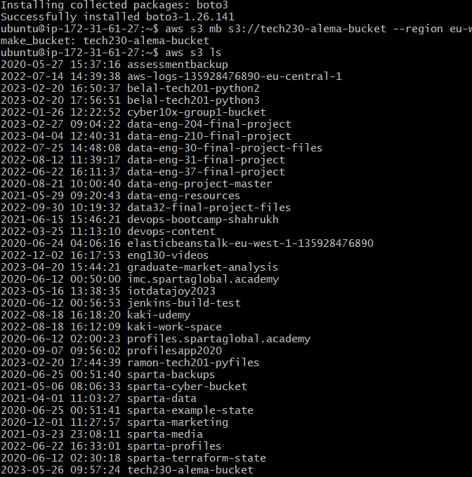
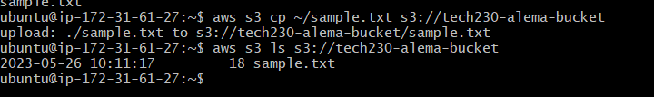
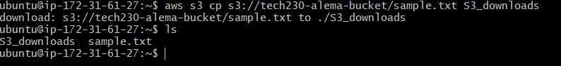
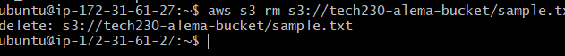
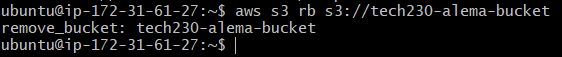

## Setting up

1. On aws, create an EC2 instance with ubuntu. For this demo, I will use ubuntu 20.04.

2. Use The following commands:

```
# Update the sources list
sudo apt-get update -y

# upgrade any packages available
sudo apt-get upgrade -y

# install python
sudo apt install python3 -y

# install pip
sudo apt install python3-pip -y

# install awscli

sudo pip3 install awscli
```


3. The next step is to configure using the command:
```
aws configure
```

4. You will then be prompted to input your access keys 

5. Then, we need to specify the region:

```
eu-west-1
```

6. You can set default output format to e.g. 'json'

7. You can use to see all buckets 
```
aws s3 ls
```


8. The next step is to Install boto3 with the command:

```
pip install boto3
```

## Creating a bucket

To create a bucket:

aws s3 mb s3://tech230-alema-bucket --region eu-west-1

To check to see if your bucket has been made, use 'aws s3 ls'




## Uploading a file to bucket

1. Create a file 

```
touch sample.txt
```

2. To upload the file, use:

```
aws s3 cp ~/sample.txt s3://tech230-alema-bucket
```

3. You can check that it has been uploaded with:
aws s3 ls s3://tech230-alema-bucket




## Download file

To download a file from a bucket, use:

```
aws s3 cp s3://tech230-alema-bucket/sample.txt S3_downloads
```

You can then use 'ls' to check




## Deleting file from the bucket

To delete a file, use:

```
aws s3 rm s3://tech230-alema-bucket/sample.txt
```




## Deleting your bucket

Once you have deleted you file(s), only then should you delete your bucket using:

```
aws s3 rb s3://tech230-alema-bucket
```

You can check that it has been removed using this command again 'aws s3 ls'




# Using python boto3 to automate CRUD:

To do the CRUD operations, you can use python scripts

1. First, create a file using the 'touch' command e.g. 'touch creating-bucket.py'.
2. Edit the file to add a script using 'nano creating-bucket.py'
3. You would then enter your approrite script (see below)

## To access s3

```
import boto3

#connect to s3
s3 = boto3.resource("s3")

#list buckets
for bucket in s3.buckets.all():
    print(bucket.name)

```

## To create bucket

```
import boto3

#connect to s3
s3 = boto3.client("s3")

#create a bucket
bucket_name = s3.create_bucket(Bucket = "tech230-alema-boto", CreateBucketConfiguration={"LocationConstraint": "eu-west-1"})

print(bucket_name)
```

## To upload to bucket

```
import boto3

#connect to s3
s3 = boto3.resource("s3")

#open the file we want to send, store it in a variable called data
data = open("sample.txt", "rb")

#specify what bucket we are sending the file to, .put object names the file and sends it's contents
s3.Bucket("tech230-alema-boto").put_object(Key="sample.txt", Body=data)
```

## To download from bucket

```
import boto3


#connect to s3
s3 = boto3.client("s3")

#download from s3 bucket
s3.download_file("tech230-alema-boto", "sample.txt", "sampletext1.txt")

print(s3.download_file)
```

## To delete from bucket

```
import boto3


#connect to s3
s3 = boto3.client("s3")

#download from s3 bucket
s3.download_file("tech230-alema-boto", "sample.txt", "sampletext1.txt")

print(s3.download_file)
```

## To delete bucket

```
import boto3

#connect to s3
s3 = boto3.resource("s3")


bucket = s3.Bucket("tech230-alema-boto")
response = bucket.delete()

print(response)
```


